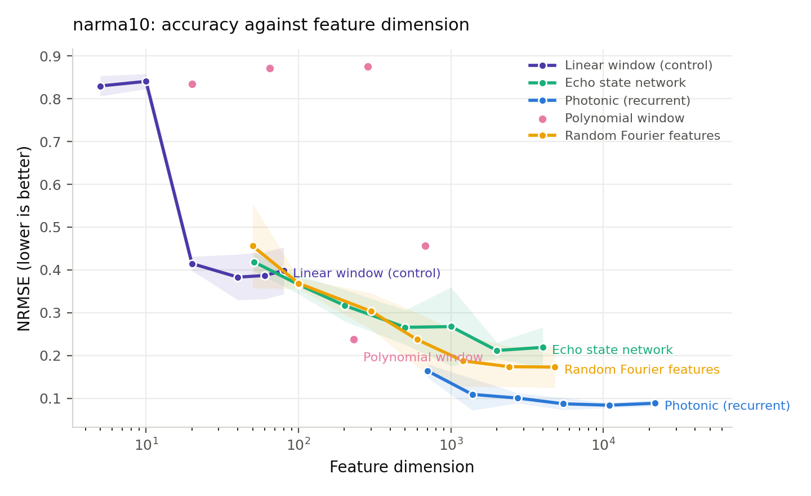
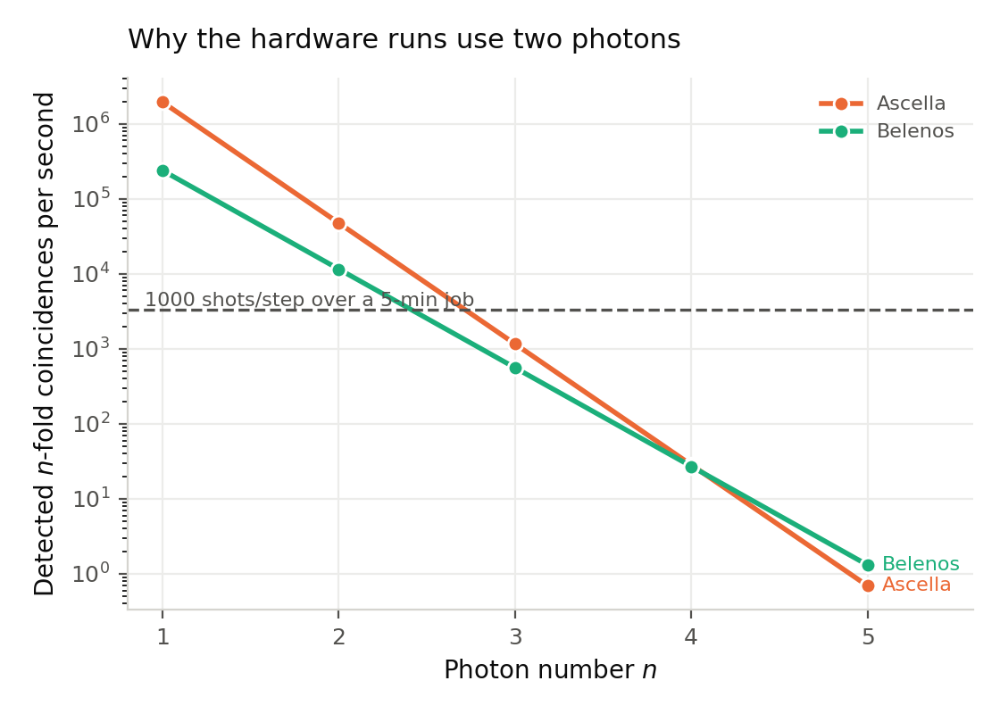

<div align="center">
  <h1>Team Qedi 🐈‍⬛</h1>
  <p><strong>EPFL Quantum Hackathon 2026 • Quandela Challenge → Academic Paper Extension</strong></p>
  <h3>A Recurrent Linear-Optical Reservoir for Time-Series Forecasting</h3>
  <p><i>Standard reservoir-computing benchmarks, matched-capacity baselines, and robustness at measured Quandela hardware noise levels.</i></p>
</div>

> **Scope.** Accuracy results are produced by exact classical simulation of linear-optical
> Fock probabilities. Noise results are produced by Perceval's `NoiseModel` at the operating
> points measured on Quandela's Ascella and Belenos processors. Neither is a hardware
> measurement. A hardware run is implemented and rehearsed (`hardware/run_reservoir_hw.py`)
> but both QPUs have been in `maintenance` throughout this work; the section below states
> exactly what is and is not measured on a chip.

> **Concurrent and independent work.** A closely related architecture for swaption-surface
> reconstruction was independently proposed by Amanov & Azamov (arXiv:2603.10707);
> a transverse-field Ising QRC for realised-volatility forecasting is in Li, Mukhopadhyay,
> Bayat & Habibnia (arXiv:2505.13933). This work differs by (i) a recurrent formulation with
> state feedback rather than a static or windowed map, (ii) benchmarking under the standard
> input-driven protocol so numbers are comparable to the reservoir-computing literature,
> (iii) matched-capacity baselines, and (iv) a noise study at measured device parameters.

---

## 1. What changed, and why

An earlier version of this model (`src/multi_qrc.py`, kept for reproducibility) encoded a
sliding window of the series into interferometer phases and read out Fock probabilities. It
had no state. Re-examining it produced four findings that invalidated the previous results:

1. **The quantum features were not contributing.** On NARMA-10 under that code's own
   protocol, a plain ridge on the raw window scored MSE `5.24e-3` against the model's
   `5.38e-3`. Sweeps over encoding gain, circuit depth, photon number, mode count and
   feature standardisation found no configuration beating that control by more than noise.
   The input spanned only 0.58 rad of the available 2π phase range, leaving the quantum
   block with 16× less variance than the classical block appended beside it, so the ridge
   effectively ignored it.
2. **The benchmark protocol was not comparable to the literature.** The model was fed the
   target's own history; the standard NARMA benchmark drives with an exogenous input and
   requires the model to build the target's dynamics internally.
3. **There was no recurrence.** Measured linear memory capacity was exactly the window
   length — the signature of a windowed feature map, not a reservoir.
4. **The ESN baseline had no input-scaling parameter.** With one, it reaches NRMSE 0.183 on
   NARMA-10, matching the literature's ≈0.185. Previously it was far too easy to beat.

The current model adds a state that persists across timesteps:

```
e_t = g_in · W_in u_t  +  g_fb · W_fb s_{t-1}      (phases, radians)
p_t = photonic_layer(e_t)                          (unbunched Fock probabilities)
s_t = (1 − leak) · s_{t-1} + leak · p_t            (leaky integration)
```

`W_in`, `W_fb` and the interferometers are fixed random draws; only the ridge readout is
trained. **The feedback is classical and happens between shots**, so a recurrent run costs
exactly the same shot budget as the windowed model — no optical memory or fast feed-forward
is required.

---

## 2. Results

Standard input-driven protocol, 5 seeds, NRMSE (RMSE ÷ std of the target; lower is better).
The ridge penalty is selected on a validation slice **per model**, and every model passes
through the identical readout and metric (`src/rc_protocol.py`).

| Model | Mackey-Glass (h=17) | NARMA-10 | NARMA-20 | S&P 500 RV |
|---|---|---|---|---|
| **Photonic (recurrent)** | **0.0007** | **0.0912 ± 0.011** | **0.2262 ± 0.034** | 0.7023 |
| Photonic (no feedback) | 0.0007 | 0.2026 ± 0.028 | 0.4616 ± 0.119 | 0.7023 |
| Echo state network | 0.0007 | 0.2997 ± 0.092 | 0.4522 ± 0.074 | **0.6822** |
| Random Fourier features | 0.0021 | 0.1816 ± 0.047 | 0.4555 ± 0.073 | 0.7284 |
| Polynomial window | 0.0284 | 0.1690 ± 0.037 | 0.5103 ± 0.151 | 0.7045 |
| Linear window (control) | 0.6132 | 0.4200 ± 0.066 | 0.4861 ± 0.086 | 0.6957 |

Diebold–Mariano with Newey–West HAC, against the photonic model:

- **NARMA-10 and NARMA-20** — p < 0.001 against every baseline. The photonic model wins.
- **Mackey-Glass** — p = 0.41 vs the ESN. A genuine tie; the task saturates.
- **S&P 500 RV** — p = 0.45–0.88. Nothing is distinguishable. The photonic model ranks third
  of six and we report that as-is; the Hansen MCS retains all six models.

**Recurrence is what carries the result.** Removing the feedback and changing nothing else
doubles the error on both NARMA tasks (p < 0.001).

### Is it the optics, or just more features?

The tuned photonic configuration uses more features than the baselines, so every family was
swept across a common dimension range (`experiments/matched_capacity.py`, 3 seeds):

| Model | dim | NRMSE |
|---|---|---|
| **Photonic** | **1381** | **0.109** |
| Photonic | 701 | 0.164 |
| Random Fourier features | 1200 | 0.188 |
| Echo state network | 1001 | 0.268 |
| Polynomial window | 679 | 0.457 |

At matched dimension the photonic map is ahead, and it stays ahead: the ESN saturates past
~2000 units while the photonic model continues to improve. A single reservoir at dim 701
already matches the ESN's best.



### What it is winning with

`experiments/memory_ipc.py` measures linear memory capacity (Jaeger) and information
processing capacity (Dambre et al.):

| System | dim | Linear MC | IPC total | IPC per feature |
|---|---|---|---|---|
| Photonic (no feedback) | 132 | 10.5 | 111.9 | **0.85** |
| ESN (200) | 201 | 27.0 | 123.9 | 0.62 |
| Photonic (recurrent) | 132 | 11.1 | 69.3 | 0.53 |
| ESN (500) | 501 | 29.6 | 213.9 | 0.43 |
| Linear window (20) | 20 | 19.1 | 13.0 | 0.65 |

The photonic map packs more nonlinear capacity per feature than an ESN but carries less
linear memory. It trades memory depth for nonlinearity — which is why it wins on NARMA,
where the target is a low-order polynomial of a bounded stretch of history, and does not win
on tasks that reward long linear memory.

---

## 3. Robustness to hardware noise

This is the question a hardware collaborator actually asks, and it follows the approach
suggested by Quandela: see
[MerLin's noisy-simulation guide](https://merlinquantum.ai/0.4/user_guide/noisy_simulations.html).
Every noisy evaluation runs through Perceval's `NoiseModel` with **threshold detectors**, so
the numbers come from Quandela's own device model rather than an approximation of ours. The
configuration used is the hardware-viable one (2 photons, 12 modes, depth 1) — not the
accuracy-tuned one, which no current device could run.

Measured operating points, read live from the Quandela cloud API:

| | Ascella | Belenos |
|---|---|---|
| Clock | 80 MHz | 4.94 MHz |
| HOM visibility | 86.36 % | 82.7 % |
| g² (0) | 1.95 % | 18.2 % |
| Transmittance | 2.44 % | ~4.8 % |
| Detectors | threshold | threshold, 24 modes |

**Device imperfections cost essentially nothing:**

| Sweep | Range | NRMSE |
|---|---|---|
| Indistinguishability | V = 0.50 → 1.00 | 0.2468 → 0.2486 (flat) |
| g²(0) | 0.00 → 0.30 | 0.2479 → 0.2498 (+0.8 %) |
| Full Ascella model | all sources at once | 0.2483 vs 0.2479 noiseless |
| Full Belenos model | all sources at once | 0.2465 vs 0.2479 noiseless |

**Finite sampling is the entire story:**

| Coincidences per timestep | NRMSE |
|---|---|
| 1 000 | 0.411 ± 0.044 |
| 10 000 | 0.380 ± 0.015 |
| 30 000 | 0.343 ± 0.030 |
| ∞ | 0.275 ± 0.028 |

A reservoir is a random feature map, and the readout is refitted on whatever the device
actually produces — so a slightly different map is still a perfectly good map. Sampling
noise is different in kind: it corrupts each feature independently on every timestep and
cannot be absorbed by the readout.

The practical consequence is a design rule that inverts the usual instinct: **optimise for
coincidence rate, not photon quality.** Rate falls as `transmittance^n`, so photon number is
the dominant lever:

| Platform | n=2 | n=3 | n=4 |
|---|---|---|---|
| Ascella | 4.8e4 /s | 1.2e3 /s | 28 /s |
| Belenos | 1.2e4 /s | 5.6e2 /s | 27 /s |

Reaching 3×10⁴ coincidences per timestep costs **0.63 s at two photons on Ascella**, 26 s at
three photons, and about 18 minutes at four. This is why the hardware path uses two photons.
The earlier three-photon probe in this repository returned ~48 counts from 1000 requested
shots spread over 56 Fock bins, and its features correlated only 0.18–0.48 with simulation —
a direct consequence of the same scaling.



---

## 4. Hardware status

**Both `qpu:ascella` and `qpu:belenos` have reported `status: maintenance` throughout this
work, so no result in this repository is a QPU measurement.** What exists:

- A validated smoke test and a 10-step, 1000-shot probe on `qpu:belenos` from an earlier
  three-photon configuration (`hardware/run_log.csv`), which is what established the
  coincidence-rate problem.
- `hardware/run_reservoir_hw.py`, which runs the current model on a QPU and reports
  hardware, simulation and classical-only readouts on identical timesteps. Rehearsed locally
  and against the cloud simulator.
- Job `96baa2b6-…` was cancelled by the platform at 307 s having completed 4 % of its
  iterations — the free tier's 5-minute cap. Submission is now chunked and each chunk is
  cached independently, so an interrupted run resumes without re-billing shots.

Because closed-loop feedback cannot be batched into a single cloud job, two protocols are
provided and both will be reported:

- `replay` — the recurrence is run in simulation to produce the phase trajectory, which is
  then replayed on hardware as one batched job. The chip evaluates the same circuit settings
  the closed-loop system would have visited, and the readout is trained on hardware-measured
  features. **The feedback path itself is simulated**, and any write-up must say so.
- `openloop` — feedback disabled, every timestep independent. Genuinely end-to-end on
  hardware with no simulation in the loop; a weaker model but a stronger claim.

Local calibration puts the viable operating point at 600 timesteps, 12 modes, 2 reservoirs,
where the reservoir gives a 1.46× improvement over the classical control.

---

## 5. Layout

```
src/
  photonic_core.py    exact boson-sampling probabilities; matches MerLin to 1e-16, 310x faster
  temporal_qrc.py     the recurrent reservoir and its readout
  rc_protocol.py      shared split, ridge-penalty selection, metrics
  tasks.py            benchmark registry with literature-standard protocols
  baselines_rc.py     ESN (with input scaling), RFF, polynomial, linear control
  noise.py            hardware specs, Perceval noise backend, coincidence-rate model
  dm_mcs.py           Diebold-Mariano (Newey-West HAC) and Hansen Model Confidence Set
  multi_qrc.py        the previous windowed model, kept so old numbers reproduce
experiments/
  tune_temporal.py    Optuna search, same budget for every model
  run_benchmarks.py   headline table with DM and MCS
  matched_capacity.py NRMSE against feature dimension
  memory_ipc.py       memory and information processing capacity
  noise_study.py      the robustness sweeps
  make_figures.py     figures
hardware/             QPU execution path (see section 4)
tests/                36 tests; the core-vs-MerLin check gates any hardware submission
```

`src/photonic_core.py` exists because MerLin's `QuantumLayer` costs ~7 ms per forward pass
regardless of batch size, and a recurrent reservoir must step one timestep at a time. These
circuits are layered, `U = A_d · D(φ_{d-1}) ··· A_1 · D(φ_0) · A_0`, so the fixed blocks can
be built once and each timestep costs a few small matrix products plus a batch of
permanents. It computes the same distribution — the test suite checks it against both MerLin
and Perceval's SLOS backend to 1e-10.

## 6. Reproducing

```bash
conda create -n quandela python=3.11 && conda activate quandela
pip install -r requirements.txt
python -m pytest tests/ -q                                    # 36 tests
python experiments/tune_temporal.py --dataset narma10 --model all --trials 150
python experiments/run_benchmarks.py --seeds 5
python experiments/matched_capacity.py --dataset narma10 --seeds 3
python experiments/noise_study.py --dataset narma10 --sweep all --seeds 3
python experiments/make_figures.py
```

Hardware runs need a Quandela token in `PCVL_CLOUD_TOKEN` (see `hardware/README.md`) and
should be rehearsed with `--local` first; every cloud job is cached, so a re-run never
re-spends shots.

## 7. What we do not claim

- No quantum advantage. The comparison is against classical feature maps on classical data,
  and the photonic model is simulated.
- No claim on S&P 500 realised volatility, where it does not win and no model is
  statistically distinguishable from any other.
- No hardware claim until a QPU leaves maintenance and the run in section 4 completes.
- The matched-capacity comparison is the honest version of the accuracy table; the headline
  configuration uses more features than the baselines and that is stated wherever it appears.
