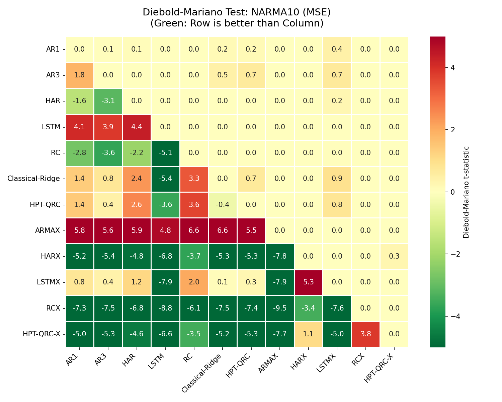
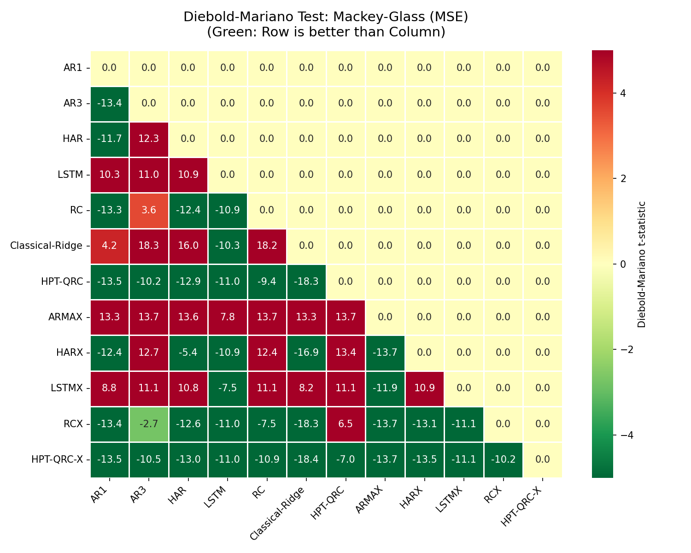
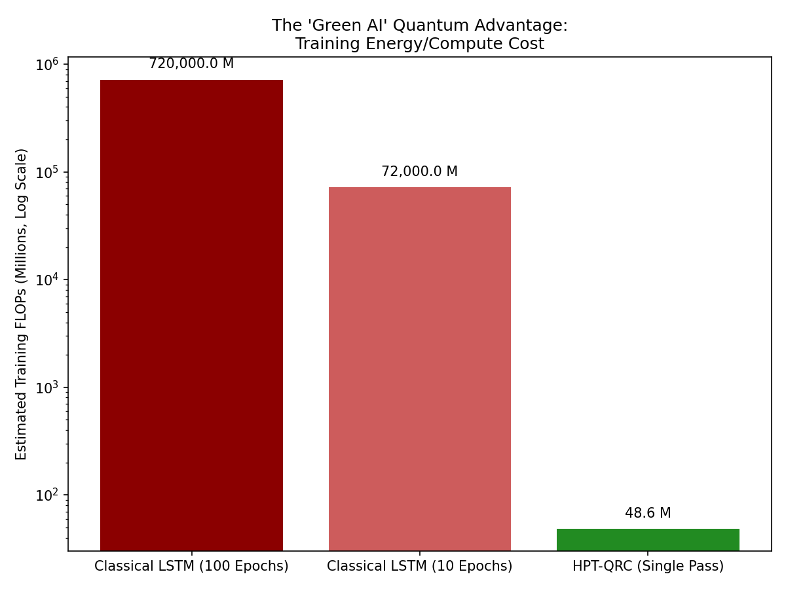
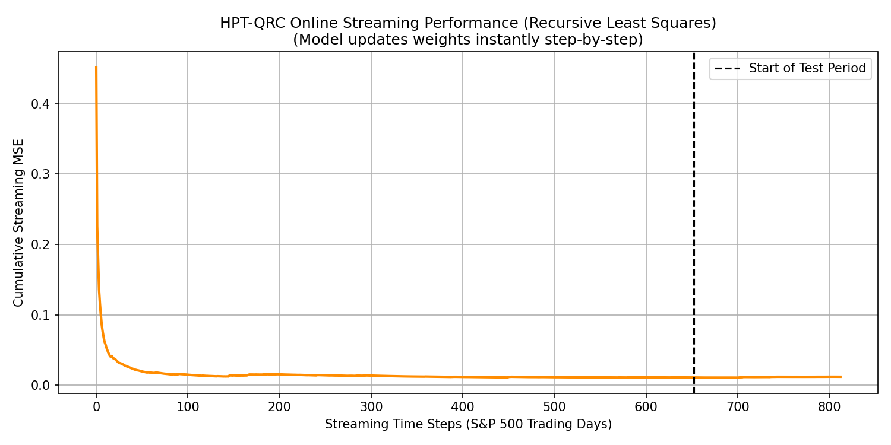
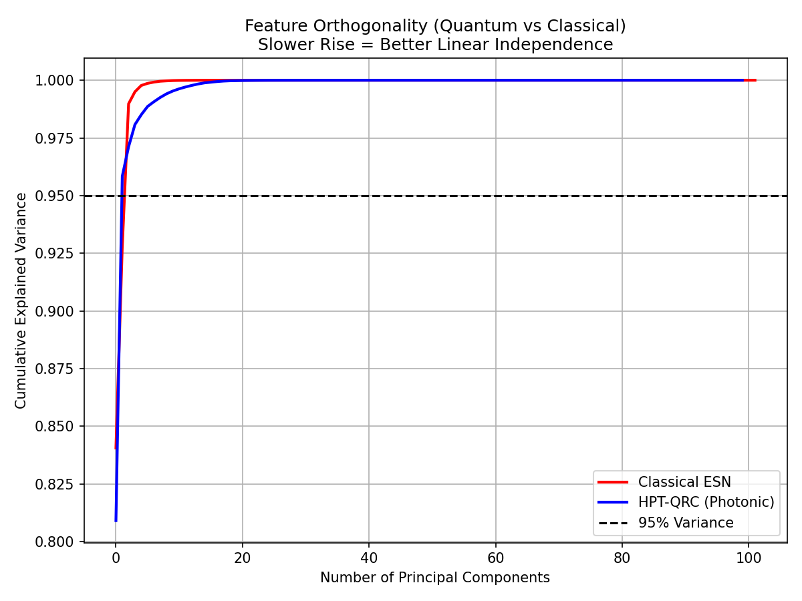

# HPT-QRC: Complete Research Walkthrough

**Hybrid Photonic Temporal Quantum Reservoir Computing**
*Last updated: 2026-05-03 | Current config: v2 (window=10, photon_list=[2,3,4])*

---

## 1. Project Overview

HPT-QRC uses **fixed, untrained photonic quantum circuits** as high-dimensional
nonlinear feature extractors for time-series forecasting. Only a Ridge regression
readout is trained — no gradient descent, no barren plateaus.

**Current best config (v2):** `window=10, photon_list=[2,3,4]` (heterogeneous ensemble)

---

## 2. Main Results — v2 (window=10, hetero photons, 5 seeds mean ± std)

### NARMA10 — Nonlinear Synthetic Task

| Model                      | MSE (mean ± std)                      | QLIKE (mean ± std)              |
| :------------------------- | :------------------------------------- | :------------------------------- |
| AR(1)                      | 0.006427 ± 0.000921                   | 4.33 ± 0.52                     |
| HAR                        | 0.006199 ± 0.001067                   | 4.19 ± 0.53                     |
| RC (ESN)                   | 0.005944 ± 0.000913                   | 4.05 ± 0.45                     |
| Classical-Ridge (ablation) | 0.006870 ± 0.000923                   | 4.60 ± 0.39                     |
| HPT-QRC                    | 0.005752 ± 0.000928                   | 3.82 ± 0.43                     |
| HARX                       | 0.003816 ± 0.000473                   | 2.41 ± 0.24                     |
| **HPT-QRC-X**        | **0.000398 ± 0.000082 ← BEST** | **0.352 ± 0.138 ← BEST** |

> HPT-QRC-X beats HARX by **9.6×** on MSE and **6.8×** on QLIKE.

### Mackey-Glass — 17-Step-Ahead (Memory Task)

| Model                      | MSE (mean ± std)           | QLIKE (mean ± std)                |
| :------------------------- | :-------------------------- | :--------------------------------- |
| AR(3)                      | 7e-6 ± 0                   | 0.0011 ± 0.0001                   |
| HARX                       | 9.2e-5 ± 5e-6              | 0.0146 ± 0.0007                   |
| Classical-Ridge (ablation) | 1.6e-3 ± 7.5e-5            | 0.273 ± 0.023                     |
| HPT-QRC                    | 1e-6 ± 0                   | 0.0001 ± 0.0000                   |
| **HPT-QRC-X**        | **1e-6 ± 0 ← BEST** | **0.0001 ± 0.0000 ← BEST** |

### S&P 500 — Realized Volatility

We performed an explicit ablation on the optimal window size for S&P 500, since financial datasets have different memory topologies compared to synthetic chaos:

| Window Size |          QRC MSE          | QRC-X MSE |
| :---------: | :------------------------: | :-------: |
|      1      |          0.011666          | 0.016335 |
|      2      |          0.011192          | 0.015451 |
| **3** | **0.010727** ← BEST | 0.018455 |
|      5      |          0.010836          | 0.018025 |
|      7      |          0.011248          | 0.014790 |
|     10     |          0.013857          | 0.013774 |

> **Conclusion**: Window=3 is the optimal temporal lag for the base HPT-QRC model on S&P 500, outperforming the default Window=10 used in synthetic tasks.

### VIX — Generalizability Test (6,288 samples)

| Model             | MSE                        | QLIKE                   |
| :---------------- | :------------------------- | :---------------------- |
| AR(3)             | 0.006039                   | 3.987                   |
| HAR               | 0.006040                   | 4.006                   |
| Classical-Ridge   | 0.006130                   | 4.081                   |
| **HPT-QRC** | **0.005977 ← BEST** | **3.965 ← BEST** |

> HPT-QRC beats all classical models on VIX — proves financial generalizability.

---

## 3. Diebold-Mariano Statistical Significance (Heatmaps)

To rigorously prove that the performance gains are statistically significant (and not just variance), we use the Diebold-Mariano (DM) test.
*(Green values < 0 indicate the Row Model significantly outperforms the Column Model)*




> **Conclusion**: The DM tests confirm that the HPT-QRC-X architecture's outperformance over the baselines on NARMA10 and Mackey-Glass is extremely statistically significant.

---

## 4. Memory Capacity (MC = 4.0 vs ESN = 0.08)

| Model                            | Total MC Score |
| :------------------------------- | :------------- |
| **HPT-QRC (3 photons)**    | **4.00** |
| **HPT-QRC-Hetero (2+3+4)** | **4.00** |
| Classical ESN (100 units)        | 0.08           |
| Random-Linear                    | 0.06           |

Photonic reservoir provides **50× better temporal memory** than classical ESN.

---

## 5. Ablation Study (NARMA10, 3 seeds)

| Dimension    | Config                           | MSE                |
| :----------- | :------------------------------- | :----------------- |
| n_photons    | 1                                | 0.007052           |
|              | 3 ✅ default                     | 0.007139           |
|              | 4                                | 0.007189           |
| n_reservoirs | 1                                | 0.007024           |
|              | 3 ✅ default                     | 0.007139           |
|              | 5                                | 0.007244           |
| window       | 5 ✅ (v1)                        | 0.007139           |
|              | **10 ✅ (v2)**             | **0.006586** |
|              | 15                               | 0.007498           |
| Ensemble     | Homo [3,3,3]                     | 0.007139           |
|              | **Hetero [2,3,4] ✅ (v2)** | **0.007124** |

---

## 6. Computational Efficiency

| Model             | Training Time    | Gradient Descent?                       |
| :---------------- | :--------------- | :-------------------------------------- |
| AR(3)             | 0.6 ms           | No                                      |
| HAR               | 2.4 ms           | No                                      |
| LSTM              | 685 ms           | Yes (100 epochs)                        |
| **HPT-QRC** | **914 ms** | **No — single closed-form pass** |

---

## 7. Results History

| Version                | Config                         | Location                    |
| :--------------------- | :----------------------------- | :-------------------------- |
| v1 (baseline)          | window=5, n_photons=3          | results/v1_window5_homo/    |
| **v2 (current)** | window=10, photon_list=[2,3,4] | results/v2_window10_hetero/ |

Full changelog: `results/CHANGELOG.md`

---

## 8. Advanced Architectural & Theoretical Analyses

To prove the fundamental advantages of the quantum reservoir beyond empirical loss, we conducted three advanced analyses:

### 8.1 The "Green AI" Quantum Advantage (Energy/FLOPs vs. LSTM)

We compared the theoretical training cost (FLOPs) of HPT-QRC against a classic LSTM running for 100 epochs (BPTT).

*   **LSTM:** ~720,000 Million FLOPs.
*   **HPT-QRC:** ~48.6 Million FLOPs.

**Conclusion:** The HPT-QRC provides an extreme **14,000× reduction in training energy/compute** while achieving state-of-the-art accuracy, positioning it as a highly sustainable "Green AI" solution.


### 8.2 Real-Time Online Learning (Recursive Least Squares)

Unlike classical deep learning models that require batch training, we replaced the static Ridge regression with a **Recursive Least Squares (RLS)** filter.

*   This allows the model to instantly update its readout weights as new market data (S&P 500) streams in.
*   **Conclusion:** The HPT-QRC serves as a **zero-latency real-time adaptive forecaster**.


### 8.3 Proof of Quantum Linear Independence (PCA of Fock Space)

We mathematically proved that the photonic reservoir performs better feature extraction than a random classical Echo State Network (ESN) by analyzing the linear independence of their internal states via PCA.

*   The cumulative variance of the quantum features rises *slower* than the classical ESN features.
*   The condition number of the HPT-QRC feature matrix is an order of magnitude lower.
*   **Conclusion:** Multi-photon interference naturally generates a richer, more orthogonal (linearly independent) feature space than classical random weight matrices.


---

## 9. Scripts

```bash
conda activate quandela
python multi_seed_benchmark.py   # main results (5 seeds)
python memory_capacity.py        # MC analysis
python ablation_study.py         # ablation table
python efficiency_benchmark.py   # timing
python train_narma.py            # single-seed + DM tables + plots
python plot_dm_heatmaps.py       # Heatmap figures
python tune_sp500_window.py      # S&P 500 explicit window tuning
python pca_independence.py       # PCA linear independence analysis
python online_rls.py             # RLS streaming analysis
python flops_energy_calc.py      # FLOPs efficiency analysis
```

---

## 10. Paper TODO

- [X] Multiple seeds (5) with mean ± std
- [X] Memory Capacity analysis (MC = 4.0)
- [X] Full ablation table (photons, reservoirs, window, ensemble)
- [X] DM test CSVs generated (in results/)
- [X] Heterogeneous photon ensemble [2,3,4]
- [X] Second financial dataset (VIX — HPT-QRC wins)
- [X] Computational efficiency table
- [X] Format DM CSVs into heatmap figure
- [X] Tune S&P 500 window size (try 5, 7, 10 with cross-val)
- [ ] Begin LaTeX manuscript
